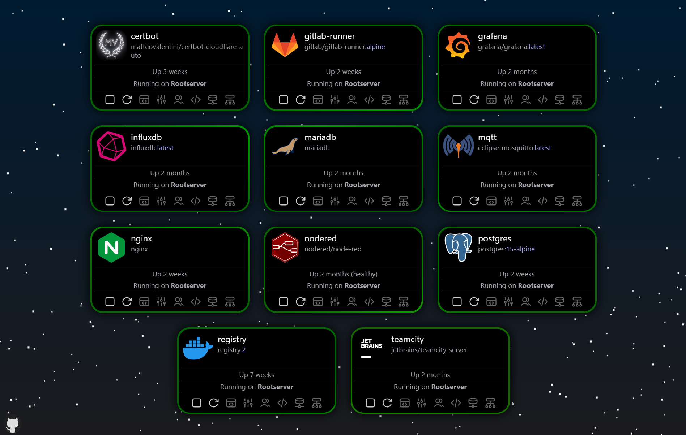

# Docker Visualizer

Web-based visualizer for Docker containers with full container controls. **Work in progress!**



## Features
- Visualize and manage Docker containers
- Set custom icons on image-, publisher- and repository-level
## Planned Features
- Connect multiple Docker hosts on different servers
- Monitor container stats, logs, and events
- Inspect container filesystem
- Multi-User support with Access Control

## Get started with docker-compose
```yaml
services:
  visualizer:
    image: mvat/docker-visualizer
    container_name: docker-visualizer
    restart: always
    ports:
      - 3000:3000
    volumes:
      - /var/run/docker.sock:/var/run/docker.sock
    environment:
      - DOCKER_SERVER_NAME=<Server Name>
      - DOCKER_PROXY_SECRET=<your-secret>
```
Set `<Server Name>` to the name of your Docker server.

Generate a secret with `openssl rand -hex 32` and replace `<your-secret>` with the generated secret.

### Enabling user controls
You can set the following environment variables to ```true``` to enable specific user controls:

| Environment Variable | Description |
|----------------------|-------------|
| PERMISSION_START_STOP | Allow users to start, stop and restart containers |
| PERMISSION_DELETE | Allow users to delete containers |

### Setting custom icons
To set custom icons, you need to mount the folder `/app/public/imageicon` inside the container to a local folder. Inside the mounted folder, you can create subfolders with the name of the repository, publisher or image and place the icon inside the subfolder. The icon must be named `<name>.png` or `<name>.svg` and should be square.

The folder structure should look like this:
```
imageicon
├── dockerhub                              # Folder for Docker Hub icons                          
│   ├── matteovalentini.svg                # Icon for the publisher matteovalentini on Docker Hub
│   └── mvat
│       └── docker-visualizer.png          # Icon for the image mvat/docker-visualizer on Docker Hub
│
└── my-registry.com
    └── my-image
        └── my-icon.png
```

**Be aware that by mounting the imageicon folder, you overwrite the default icons.**

## License
This project is licensed under the MIT License - see the [LICENSE](LICENSE) file for details.
